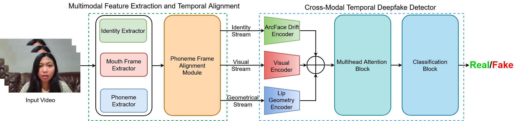

# PIA: Deepfake Detection Using Phoneme-Temporal and Identity-Dynamic Analysis

Soumyya Kanti Datta, Tanvi Ranga, Chengzhe Sun, Siwei Lyu

Accepted by APAI ICCV 2025
### [Paper](https://arxiv.org/abs/2510.14241) 

## Abstract
The rise of manipulated media has made deepfakes a particularly insidious threat, involving various generative manipulations such as lip-sync modifications, face-swaps, and avatar-driven facial synthesis. Conventional detection methods, which predominantly depend on manually designed phoneme–viseme alignment thresholds, fundamental frame-level consistency checks, or a unimodal detection strategy, inadequately identify modern-day deepfakes generated by advanced generative models such as GANs, diffusion models, and neural rendering techniques.
These advanced techniques generate nearly perfect individual frames yet inadvertently create minor temporal discrepancies frequently overlooked by traditional detectors. We present a novel multimodal audio-visual framework, Phoneme-Temporal and Identity-Dynamic Analysis(PIA), incorporating language, dynamic face motion, and facial identification cues to address these limitations. We utilize phoneme sequences, lip geometry data, and advanced facial identity embeddings. This integrated method significantly improves the detection of subtle deepfake alterations by identifying inconsistencies across multiple complementary modalities.

# Inference: 

Code will be available soon.
